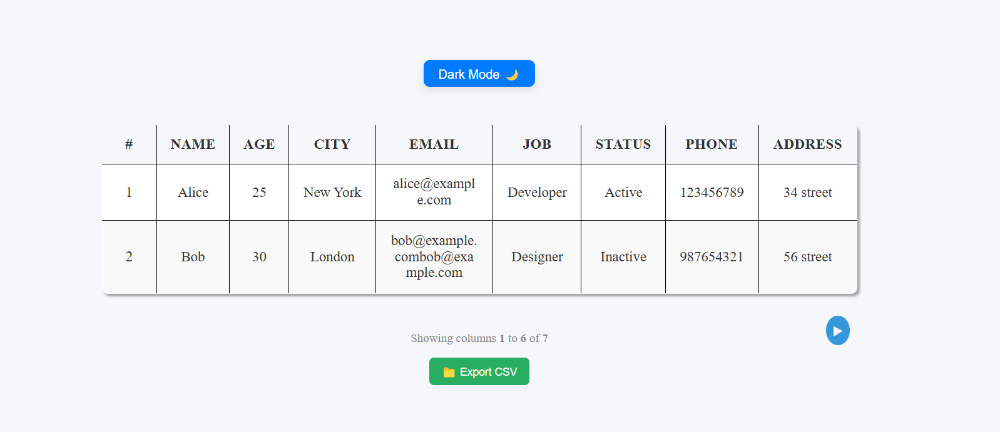
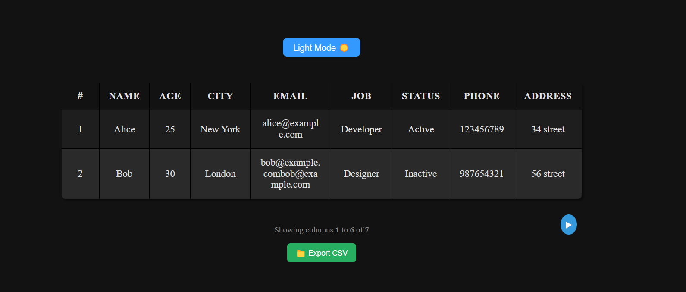
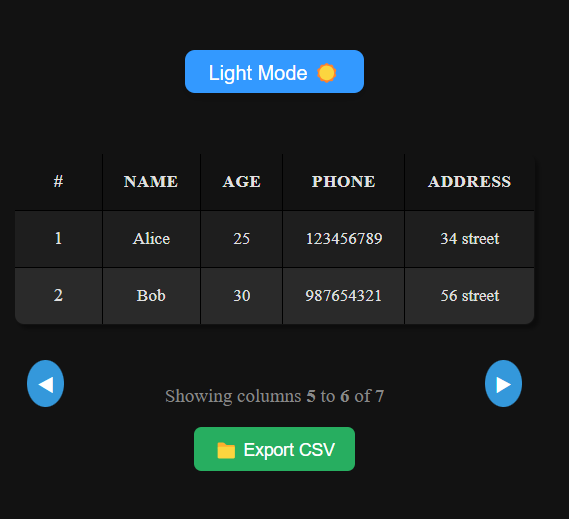
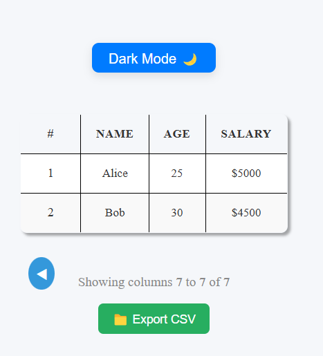

# Responsive Table with Dynamic Features

This is a responsive table component built with React. It supports dynamic column sliding, theme toggling (light/dark mode), and allows the export of data to a CSV file. It is highly customizable and designed to be responsive, adjusting the number of columns displayed based on the screen size.

## Features ✨
- **Responsive Design**:  The table is responsive and adapts to different screen sizes. As the screen size decreases, columns are hidden, and a sliding feature is activated for smaller screens.

- **Sticky Columns**:  Columns you want to remain visible while scrolling can be made sticky by passing them through the stickyKeys prop.
- **CSV Export 📁**: Export visible table data to a CSV file.

- **Action Column**: An action column can be shown with options like "Edit" or "Delete". To display this, set 'showActionColumn={true}'.

- **Theme Toggle 🌙☀️**: Switch between light and dark themes using the built-in theme toggle button.

## 📸 Screenshots

<table>
  <tr>
    <td>
      
    </td>
    <td>
      
    </td>
  </tr>
  <tr>
    <td>
      
    </td>
    <td>
      
    </td>
  </tr>
</table>

# Usage 🚀

To get started with the **Responsive Table**, follow these steps:

### 1. Import the `ResponsiveTable` Component

You can use the `ResponsiveTable` component by importing it into your React app. Here’s a basic example of how to use it:

```jsx
import React from "react";
import ResponsiveTable from "./components/ResponsiveTable";

// Sample Data
const data = [
  {
    name: "Alice",
    age: 25,
    city: "New York",
    email: "alice@example.com",
    job: "Developer",
    status: "Active",
    phone: "123456789",
    address: "34 street",
    salary: "$5000",
  },
  {
    name: "Bob",
    age: 30,
    city: "London",
    email: "bob@example.com",
    job: "Designer",
    status: "Inactive",
    phone: "987654321",
    address: "56 street",
    salary: "$4500",
  },
];

// Table Headers
const headers = ["#", "Name", "Age", "City", "Email", "Job", "Status", "Phone", "Address", "Salary"];

function App() {
  return (
    <ResponsiveTable
      data={data}                   // Your data
      headers={headers}             // Your table headers
      stickyKeys={["Name", "Age"]}  // Columns that should always be visible (sticky)
      showActionColumn={true}       // Optionally show action column (Edit/Delete)
    />
  );
}

export default App;

## Installation

### 1. Clone the repository

```bash
git clone https://github.com/aghilsamei/responsive_table.git
